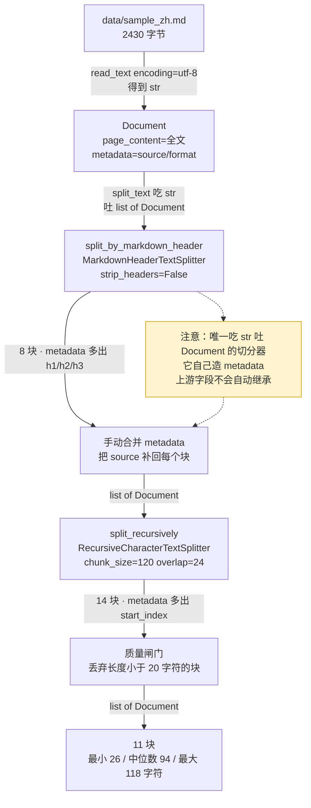
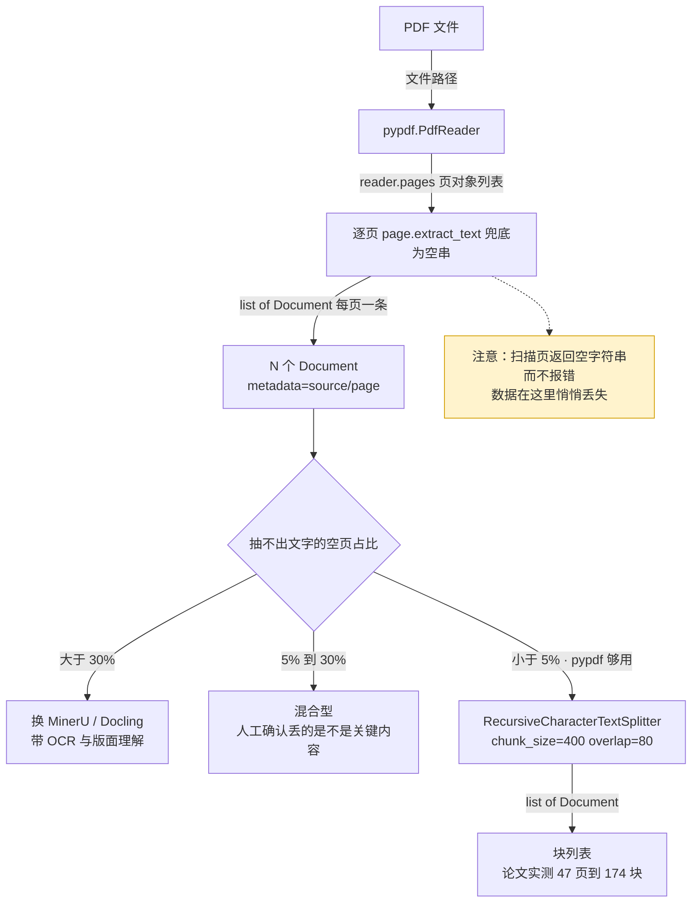
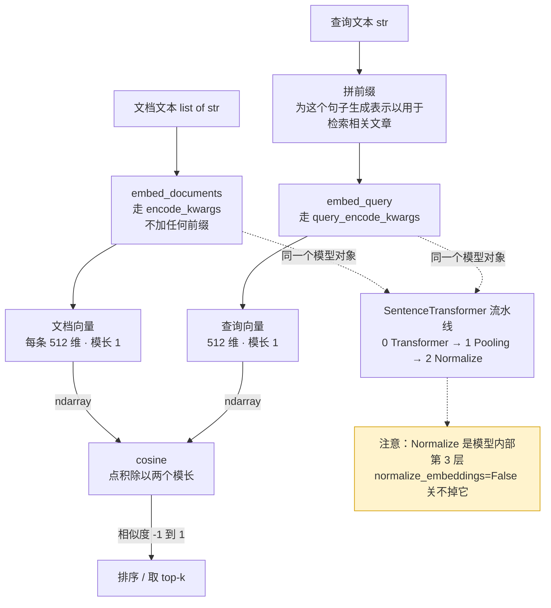
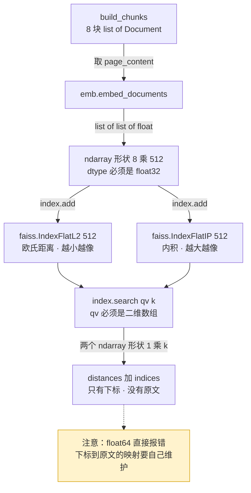
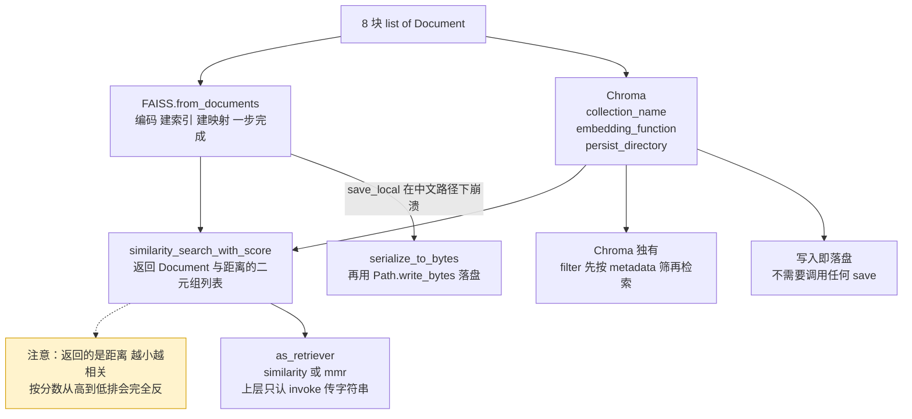

# RAG 学习脚本流程图

对应 `rag_01`~`rag_04` 四个脚本的真实执行流程。节点名就是代码里的函数名或 API 调用，
边上标的是那一步进出的数据形态，橙色警示节点标的是**会静默失败**的位置。
终端里当纯文本读，提交到 GitHub 会渲染成图。

---

## 图 1a — Markdown 结构化切分链（`rag_01_load_and_split.py`）

**这张图最该记住的**：两级切分之间那个「手动合并 metadata」不是可有可无的胶水。
`MarkdownHeaderTextSplitter` 是唯一「吃字符串、吐 `Document`」的切分器，
它自己造 metadata，所以上游的 `source` 不会自动带过来；
后面的 `split_documents` 才会自动继承，前提是这一步已经补齐了。

---

## 图 1b — PDF 通道与体检判定（`rag_01` 第 6 步 / `rag_02_pdf_probe.py`）

**这张图最该记住的**：`extract_text()` 在扫描页上返回空字符串**而不是抛异常**，
所以「空页占比」这个统计不是装饰——它是唯一能让你发现数据在这一步悄悄丢了的手段，
也是「要不要上重型解析工具」的决策依据。你的毕业论文实测 0/47，pypdf 够用。

---

## 图 2 — 嵌入的两条编码路径（`rag_03_embeddings.py`）

**这张图最该记住的**：查询和文档走的是**两条不同的编码路径**，差别只在查询端多拼了一句固定前缀。
前缀加到文档端、或者两端都加，等于查询和文档说了两套语言——不报错，只是默默掉点。
另外 `Normalize` 是模型内部的第 3 层，参数关不掉，所以向量模长恒为 1，点积直接等于余弦相似度。

---

## 图 3a — 原生 FAISS：索引里到底发生了什么（`rag_04` 第 1 步）

**这张图最该记住的**：原生 `search()` **只还给你下标，它根本不知道原文是什么**，
「下标 → Document」的映射得你自己维护——LangChain 封装帮你干的主要就是这件事。
另外对归一化向量有 `L2距离² = 2 - 2×余弦相似度`，两种索引排序必然相同，只是分数读法不同。

---

## 图 3b — LangChain 封装：FAISS 与 Chroma（`rag_04` 第 2 至 4 步）

**这张图最该记住的**：两个库的 `similarity_search_with_score` 返回的都是**距离**（实测数值完全一致，
都是 0.8091 / 0.9718 / 1.0225），越小越相关；按「分数高的排前面」写排序会完全反过来，而且不报错。
`as_retriever` 是上层唯一该依赖的接口——底下换 FAISS、Chroma 还是 Milvus，业务代码一行都不用改。

mermaid
flowchart LR
    subgraph OFF["离线侧 · python -m app.ingest（人工触发）"]
        F["data/*.md *.pdf"] -->|"str"| SP["切分 标题切 + 递归字符切"]
        SP -->|"list[Document] 带章节 metadata"| ID["生成稳定 id source#章节#start_index"]
        ID -->|"documents + ids"| UP["Chroma upsert"]
    end
    subgraph ON["在线侧 · FastAPI 进程（只读）"]
        Q["POST /v1/ask"] -->|"str"| R["retriever.ainvoke k 条"]
        R -->|"list[Document]"| C["拼编号上下文 手写"]
        C -->|"str"| P["ChatPromptTemplate 严格拒答系统提示词"]
        P -->|"PromptValue"| L["model.ainvoke asyncio.timeout 包裹"]
        L -->|"AIMessage"| CIT["解析 [编号] → Citation"]
        CIT -->|"AskResponse"| OUT["答案 + 出处"]
    end
    UP -.->|"chroma_db/ 磁盘"| R
    style UP fill:#d4edda,stroke:#28a745
    style R fill:#d4edda,stroke:#28a745
