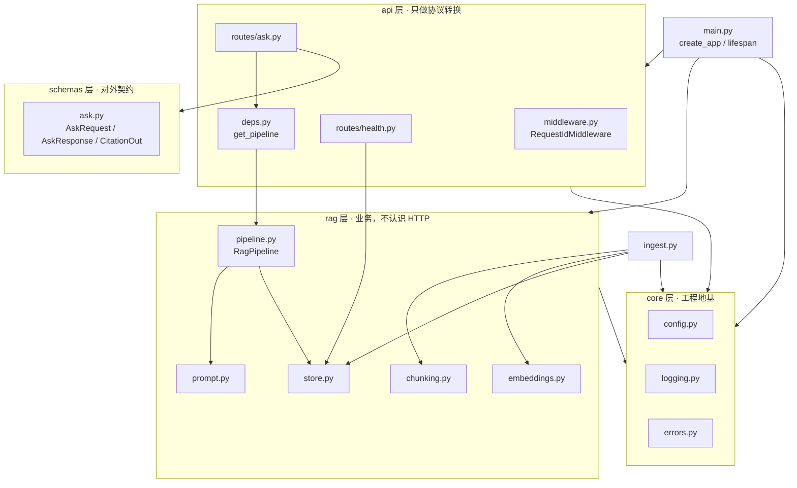
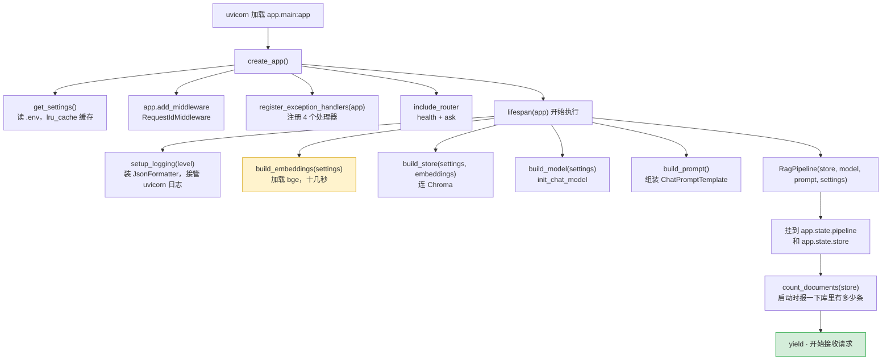
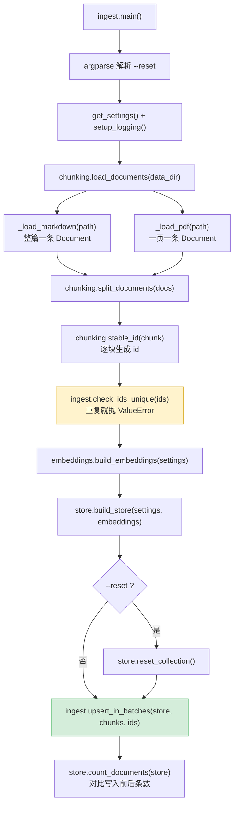
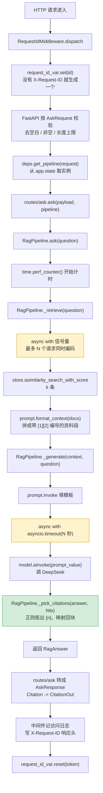
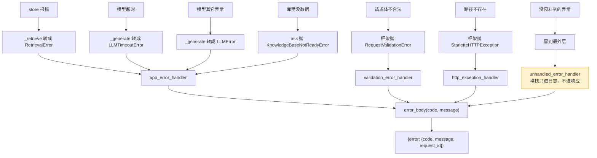

# 系统流程与调用关系

这份文档把整个服务的模块关系和函数调用链画出来，是读代码的地图。
图里每个节点都对应代码里一个真实的函数或类，可以按名字搜到。

目录：

0. [白话导读：每一层、每个文件、每个函数是干什么的](#零白话导读)
1. [模块分层与依赖方向](#一模块分层与依赖方向)
2. [启动链路](#二启动链路)
3. [离线链路：入库](#三离线链路入库)
4. [在线链路：一次问答](#四在线链路一次问答)
5. [错误处理链路](#五错误处理链路)
6. [函数索引表](#六函数索引表)

---

## 零、白话导读

后面几章的图偏技术。这一章先用大白话把整个项目讲一遍。
读完这一章再看图，每个方框你都知道它在干嘛。

### 0.1 先用一家餐厅打个比方

把这个服务想成一家只卖「问答」的餐厅。

| 餐厅里的角色 | 项目里对应什么 | 它干什么 |
|---|---|---|
| 顾客点单 | 一次 HTTP 请求 | 顾客递过来一张纸条，上面写着问题 |
| 菜单 | `schemas/` | 规定纸条该怎么写、端出去的菜长什么样 |
| 前台服务员 | `api/` | 接单、检查纸条写得对不对、递给后厨、把菜端出去。**自己不做菜** |
| 后厨 | `rag/` | 真正做菜的地方。**后厨不知道顾客是堂食还是外卖** |
| 冷库 | `chroma_db/` | 提前切好的食材都存在这里 |
| 开店前备料 | `ingest.py` | 开门之前把食材洗好、切好、放进冷库 |
| 水电和账本 | `core/` | 配置、日志、出错登记。所有人都要用，但它不参与做菜 |
| 开门营业 | `main.py` | 开门前把灯打开、把厨师叫到位，然后开始接客 |

比方到此为止，下面是准确的说法。

这个比方里最重要的一点是**分工不能串**。

服务员不能进后厨炒菜。如果服务员也炒菜，那换一个服务员就得重新教他炒菜。
对应到代码：HTTP 相关的代码里不写业务逻辑，将来换 Web 框架时业务代码一行不用改。

后厨营业时不进货。如果营业时也进货，送货的和做菜的会在冷库门口挤成一团。
对应到代码：服务进程只读向量库，写库只由 `ingest.py` 这个单独的命令来做（见 README 的 ADR-003）。

### 0.2 每一层是干什么的

项目的 `app/` 目录下分成四层。

**`core/` 地基层**

它放的是「所有地方都要用，但和问答本身无关」的东西。一共三样：配置、日志、错误。

为什么单独拿出来？因为 api 层和 rag 层都要用它们。
如果每层各写一份，日志格式就会不统一，错误响应就会五花八门。

这一层谁都不依赖。它是最底下那块砖。

**`rag/` 业务层**

它是项目真正干活的地方：把文档切碎、存进库、根据问题找资料、让模型写答案。

这一层有一个硬规矩：**不认识 HTTP**。
它里面没有一行 FastAPI 的代码，不知道请求头是什么，不知道状态码是什么。

这个规矩带来的好处是：同一套问答逻辑，可以被网页接口调用，也可以被命令行调用，
也可以在测试里直接调用，完全不用改。

**`schemas/` 契约层**

它规定「接口收什么、回什么」。

你可以把它理解成一份对外承诺书。
调用方照着这份承诺书写代码，只要承诺书不变，我们内部怎么改都不会影响他们。

FastAPI 会根据这一层自动做三件事：检查请求合不合法、生成 `/docs` 接口文档、把返回值转成 JSON。

**`api/` 接口层**

它负责和外面的世界打交道：收 HTTP 请求，调业务层，把结果打包成 HTTP 响应。

这一层应该很薄。打开 `routes/ask.py` 你会发现它只有几行真正的代码。
如果某天发现这一层的代码越来越长，通常说明业务逻辑漏到了不该在的地方。

**层与层之间的规矩**

依赖只能往一个方向走：`api` 可以用 `rag`，`rag` 可以用 `core`。

反过来不行。`core` 不许 import `rag`，`rag` 不许 import `api`。

违反这条规矩会怎样？模块之间会形成循环引用，Python 导入时直接报错。
就算没报错，改一处代码也会牵连一大片。

### 0.3 每个文件是干什么的，里面的函数又各自干什么

下面按「开店前 → 开门 → 营业中」的顺序讲，和代码实际运行的顺序一致。

---

#### `app/__init__.py` —— 最先执行的准备工作

Python 在导入 `app` 包里的任何文件之前，都会先跑这个文件。

它做两件事。

第一件，把 `.env` 文件里的内容放进系统环境变量。
这样第三方库（比如 HuggingFace）也能读到这些设置。

第二件，打开两个 HuggingFace 的开关。
一个是「只用本地已经下载好的模型，不要联网」。
另一个是「不要打印进度条」，因为进度条会把我们的 JSON 日志搞乱。

这个文件里没有函数。

---

#### `app/core/config.py` —— 读配置

它把环境变量里的各种设置读出来，变成一个 Python 对象。

比如 `.env` 里写了 `RETRIEVAL_TOP_K=4`，代码里就能用 `settings.retrieval_top_k` 拿到整数 `4`。

它还顺便做检查。`RETRIEVAL_TOP_K=abc` 这种写错的值，启动时就会报错，不会等到运行时才出问题。

| 名字 | 白话说明 |
|---|---|
| `Settings` | 一张「设置清单」。列出了这个服务所有可以调的参数，每个都有默认值，只有 API key 必须填 |
| `get_settings()` | 拿到那张设置清单。**不管调用多少次，拿到的都是同一张**，不会反复去读文件 |

---

#### `app/core/logging.py` —— 记日志

它决定日志长什么样、打到哪里去。

我们的日志每一行都是一个 JSON，比如：

```json
{"level": "INFO", "msg": "问答完成", "request_id": "586fee83c32e4c0a", "elapsed_ms": 2676}
```

为什么不打一句人话？因为线上日志是给机器搜的。
JSON 格式可以按字段搜「所有 `elapsed_ms` 大于 3000 的请求」，一句人话做不到。

| 名字 | 白话说明 |
|---|---|
| `request_id_var` | 一个「当前请求编号」的储物格。**每个请求看到的是自己那一格**，并发时互不干扰 |
| `_RESERVED` | 一份名单，列出 Python 日志系统自带的字段名。用来和我们自己加的字段区分开 |
| `_extra_fields(record)` | 从一条日志记录里，挑出我们自己额外塞进去的字段（比如 `elapsed_ms`） |
| `JsonFormatter.format(record)` | 把一条日志记录变成一行 JSON。会自动带上当前请求编号 |
| `setup_logging(level)` | 开机时调一次，把所有日志的输出格式统一改成 JSON |
| `get_logger(name)` | 拿一个记日志用的对象。每个文件开头都会调一次 |

---

#### `app/core/errors.py` —— 处理错误

它保证不管哪里出错，调用方收到的错误信息都长一个样：

```json
{"error": {"code": "LLM_TIMEOUT", "message": "生成超时，请稍后重试", "request_id": "..."}}
```

`code` 给程序看，`message` 给人看，`request_id` 给运维查日志用。

| 名字 | 白话说明 |
|---|---|
| `ErrorCode` | 所有错误码的清单。用它而不是随手写字符串，是为了防止拼错 |
| `AppError` | 我们自己的错误类型的「祖先」。每个错误都带三样东西：错误码、提示文字、HTTP 状态码 |
| `KnowledgeBaseNotReadyError` | 知识库还没准备好。比如还没入库。回 503，意思是「稍后再来」 |
| `RetrievalError` | 查资料的时候出错了。回 500 |
| `LLMTimeoutError` | 等模型回复等太久了。回 504，调用方可以重试 |
| `LLMError` | 模型那边出了别的问题，比如余额不足、被限流。回 502 |
| `error_body(code, message)` | 拼出上面那个统一格式的错误 JSON。请求编号会自动填进去 |
| `app_error_handler` | 专门接住我们自己抛的错误，翻译成 HTTP 响应 |
| `validation_error_handler` | 专门接住「请求格式不对」的错误。比如问题是空的 |
| `http_exception_handler` | 专门接住「路径不存在」这类框架级错误 |
| `unhandled_error_handler` | 兜底。前面几个都没接住的错误最后落到这里。**错误详情只写进日志，绝不返回给调用方**，防止泄露内部信息 |
| `register_exception_handlers(app)` | 开门前调一次，把上面四个处理函数登记到应用上 |

---

#### `app/rag/chunking.py` —— 读文档、切碎、编号

它把一篇长文档切成很多小段，每一段叫一个「块」。

为什么要切？用户问「退货运费谁出」，只需要文档里讲运费的那一小段。
把整篇文档塞给模型，又贵又会干扰它。

| 名字 | 白话说明 |
|---|---|
| `load_documents(data_dir)` | 打开 `data/` 目录，把里面的 `.md` 和 `.pdf` 文件都读进来 |
| `_load_markdown(path)` | 读一个 Markdown 文件，整篇作为一条 |
| `_load_pdf(path)` | 读一个 PDF 文件，每页作为一条。**扫描版 PDF 抽不出文字，这里会记一条警告** |
| `split_documents(docs)` | 把读进来的文档切成小块。先按标题切，再把太长的按字数切。每块都记住自己属于哪一章哪一节 |
| `stable_id(chunk)` | 给每一块起一个固定不变的名字，比如 `after-sales-policy.md#售后服务政策/一、七天无理由退货/退货运费#0`。同一块内容不管什么时候入库，名字都一样 |

`stable_id` 是整个入库流程里最关键的一个函数。

名字固定，重复入库就是「覆盖旧的」。
名字不固定，重复入库就是「再加一份」，库里会堆满重复内容。

---

#### `app/rag/embeddings.py` —— 把文字变成数字

计算机没法直接比较两句话意思像不像，但可以比较两串数字接不接近。

嵌入模型就是干这个翻译的：输入一段文字，输出 512 个小数。
意思相近的两段文字，翻译出来的数字也相近。

| 名字 | 白话说明 |
|---|---|
| `build_embeddings(settings)` | 加载本地的 bge 翻译模型。**文档和问题用不同的翻译方式**，问题前面要多拼一句固定的指令，这是这个模型的硬要求 |

---

#### `app/rag/store.py` —— 向量库

向量库就是存那些数字的数据库。它最拿手的事是：给它一串数字，它能很快找出库里最接近的几条。

| 名字 | 白话说明 |
|---|---|
| `build_store(settings, embeddings)` | 打开本地的 Chroma 向量库。目录不存在就先建一个 |
| `count_documents(store)` | 数一数库里现在有多少块。只取编号不取内容，所以很快 |

---

#### `app/ingest.py` —— 开店前备料

这是一个单独运行的命令：`uv run python -m app.ingest`。

它把上面三个文件串起来用：读文档 → 切块 → 起名字 → 翻译成数字 → 存进库。

| 名字 | 白话说明 |
|---|---|
| `check_ids_unique(ids)` | 检查所有块的名字有没有重复。有重复就立刻停下来报错，并告诉你是哪几个重复了 |
| `upsert_in_batches(store, chunks, ids)` | 分批把块存进库。一次存 64 块，避免一次性把显存撑爆。同名的块会被覆盖 |
| `main()` | 整个命令的流程：读参数 → 读文档 → 切块 → 起名 → 查重 → 加载模型 → 存库 → 报告存了多少 |

---

#### `app/rag/prompt.py` —— 决定给模型看什么

这个文件决定了模型的答案靠不靠谱。模型是现成的，资料也查好了，你唯一能控制的就是这里。

| 名字 | 白话说明 |
|---|---|
| `SYSTEM_PROMPT` | 给模型定的五条规矩：只能用给的资料、每句话标出处、找不到就说不知道、别说废话、数字必须原样照抄 |
| `USER_TEMPLATE` | 每次提问的格式。上面放资料，下面放问题，中间用【】隔开 |
| `format_context(docs)` | 把查到的几块资料排好，每块前面标上 `[1]` `[2]` 和出处 |
| `build_prompt()` | 把规矩和提问格式组装成一个模板，之后每次提问往里填空就行 |

---

#### `app/rag/pipeline.py` —— 后厨，一个问题变成一个答案

这是整个项目的核心。它把「查资料」「写答案」「核对出处」三件事串起来。

| 名字 | 白话说明 |
|---|---|
| `Citation` | 一条出处的信息：第几号、来自哪个文件、哪一章、有多相关、原文片段 |
| `RagAnswer` | 一次问答的完整结果：答案、出处列表、查了几条、花了多久 |
| `build_model(settings)` | 连接 DeepSeek 模型。换别家模型只要改配置里的一个名字 |
| `RagPipeline` | 后厨本身。开门时建一个，之后所有请求都用这同一个 |
| `RagPipeline.__init__` | 后厨开张：把向量库、模型、模板、配置这四样东西备齐，再设一个「最多同时几个人用显卡」的限制 |
| `RagPipeline._retrieve(question)` | 查资料。把问题翻译成数字，去库里找最接近的 4 块。**排队用显卡，防止同时挤进太多请求** |
| `RagPipeline._generate(context, question)` | 写答案。把资料和问题交给模型。**30 秒没回复就放弃**，并把各种出错情况翻译成我们自己的错误类型 |
| `RagPipeline._pick_citations(answer, hits)` | 核对出处。看答案里实际写了哪几个 `[编号]`，只把这几块作为出处返回。模型编了一个不存在的编号就跳过 |
| `RagPipeline.ask(question)` | 对外唯一的入口。按顺序调用上面三个函数，顺便计时、记日志 |

---

#### `app/schemas/ask.py` —— 菜单

| 名字 | 白话说明 |
|---|---|
| `AskRequest` | 请求长什么样。只有一个字段 `question`，会自动去掉首尾空格、不许为空、不许超过 500 字 |
| `CitationOut` | 返回给调用方的一条出处长什么样 |
| `AskResponse` | 返回给调用方的完整答复长什么样。多带一个 `request_id`，出问题时拿它去查日志 |

---

#### `app/api/middleware.py` —— 门口的登记员

每个请求进门和出门都要经过这里。

| 名字 | 白话说明 |
|---|---|
| `RequestIdMiddleware.dispatch` | 请求进门时发一个编号（上游已经给了就沿用），放进储物格；请求出门时把编号写到响应头上，再记一条「谁、访问了什么、结果如何、花了多久」的日志，最后清空储物格 |

---

#### `app/api/deps.py` —— 把后厨递给服务员

| 名字 | 白话说明 |
|---|---|
| `get_pipeline(request)` | 从应用里取出开门时就建好的那个后厨对象。如果还没建好，就报「服务还没准备好」 |

为什么不在接口里直接新建一个后厨？因为建一次要加载模型，十几秒。每个请求都建一次，服务根本没法用。

---

#### `app/api/routes/health.py` —— 两个体检接口

部署平台会定时来敲这两个门，看服务状态。

| 名字 | 白话说明 |
|---|---|
| `healthz()` | 问「你还活着吗」。只要进程在就回答「活着」。**什么都不查**，否则查的东西一出问题，平台会误以为进程死了而把它重启 |
| `readyz(request)` | 问「你能接活了吗」。会真的去数一下库里有没有数据。没有就回答「还不行」，平台会暂时不把请求发过来，但不会重启 |

---

#### `app/api/routes/ask.py` —— 问答接口

| 名字 | 白话说明 |
|---|---|
| `ask(payload, pipeline)` | 收到问题，交给后厨，把后厨的结果换成菜单上规定的格式，端出去 |

整个函数只有四步，因为活都在后厨干完了。

---

#### `app/main.py` —— 开门营业

| 名字 | 白话说明 |
|---|---|
| `lifespan(app)` | 开门和关门的流程。开门时：配日志 → 加载翻译模型 → 打开向量库 → 连上 DeepSeek → 建好后厨 → 数一下库里有多少数据。关门时：记一条日志 |
| `create_app()` | 把整个应用组装起来：装门口登记员、装错误处理、挂上接口 |
| `app` | 组装好的应用本体。启动命令就是找它 |

---

#### `tests/` —— 自动检查

测试里用了两个「替身」：假的翻译模型、假的 DeepSeek。

用替身的原因是：测试要能在没有显卡、没有网络、没有 API key 的电脑上跑，而且要跑得快。
23 个测试 20 秒跑完，一分钱不花。

| 文件 | 查什么 |
|---|---|
| `conftest.py` | 不是测试本身，是准备工作：造替身、造临时的库、造测试用的应用 |
| `test_chunking.py` | 切块对不对：出处有没有丢、章节有没有记、名字是不是固定且不重复 |
| `test_pipeline.py` | 后厨对不对：出处核对准不准、超时有没有翻译成正确的错误、空库会不会报错、并发会不会卡死 |
| `test_api.py` | 接口对不对：状态码、返回格式、请求编号、空问题会不会被挡住、错误格式统不统一 |

---

#### 项目根目录的其它文件

| 文件 | 白话说明 |
|---|---|
| `pyproject.toml` | 项目的依赖清单和工具配置 |
| `uv.lock` | 每个依赖精确到小版本号的锁定记录，保证别人装出来和你一模一样 |
| `.env` | 你的密钥，**不提交** |
| `.env.example` | `.env` 的样板，告诉别人需要填哪些变量，**提交** |
| `data/` | 知识库原始文档 |
| `chroma_db/` | 向量库文件，由 `ingest` 生成，**不提交** |
| `Dockerfile` | 怎么把项目打包成镜像 |
| `docker-compose.yml` | 怎么把「备料」和「营业」两个容器一起跑起来 |
| `.dockerignore` | 打包镜像时哪些东西不要带进去 |
| `README.md` | 项目说明、需求、架构决策 |
| `DOCKER.md` | 容器部署说明 |
| `FLOW.md` | 本文件 |

---

## 一、模块分层与依赖方向



**依赖方向是单向的**：`api → rag → core`，反过来绝不允许。

这条规则带来三个具体好处：

`rag/pipeline.py` 不 import 任何 FastAPI 的东西，所以它能被 HTTP 接口调用，也能被命令行、
定时任务、消息队列消费者调用，代码一行不用改。

换 Web 框架只动 `api/` 目录，业务代码零改动。

测试时可以直接构造 `RagPipeline` 调用，不用起 HTTP 服务（见 `tests/test_pipeline.py`）。

---

## 二、启动链路

进程启动到能接客，中间发生了什么。



**这张图最该记住的**：黄色那一步是启动的瓶颈，十几秒。
它之所以放在 `lifespan` 里而不是路由函数里，就是为了让整个进程只做一次。
如果写在路由函数里，每个请求都要等十几秒，而且并发几个就把显存撑爆了。

---

## 三、离线链路：入库

命令：`uv run python -m app.ingest`



各段的数据形态：

| 阶段 | 进去的东西 | 出来的东西 |
|---|---|---|
| `load_documents` | 目录路径 | `list[Document]`，md 整篇一条、pdf 一页一条 |
| `split_documents` | `list[Document]` | `list[Document]`，切碎，metadata 多出 h1/h2/h3 和 start_index |
| `stable_id` | 一个 `Document` | `str`，如 `after-sales-policy.md#售后服务政策/一、七天无理由退货/退货运费#0` |
| `upsert_in_batches` | 块列表 + id 列表 | `int`，写入条数 |

**黄色那一步是前置校验**：id 撞车要在这里暴露，而不是等到写库时让 Chroma 报错。
两者相差好几层调用栈，后者的报错信息看不出 id 是怎么拼出来的。

**绿色那一步是幂等的关键**：`add_documents(..., ids=...)` 底层走 upsert，
id 相同就是覆盖。所以同一份语料重复入库，库里条数不变。

---

## 四、在线链路：一次问答

请求：`POST /v1/ask`



各段的数据形态：

| 阶段 | 进去的东西 | 出来的东西 |
|---|---|---|
| `_retrieve` | `str` 问题 | `list[tuple[Document, float]]`，float 是距离，越小越相关 |
| `format_context` | `list[Document]` | `str`，形如 `[1] 来源：xx.md · 章节\n正文……` |
| `_generate` | 资料 `str` + 问题 `str` | `str`，模型生成的答案 |
| `_pick_citations` | 答案 `str` + 检索结果 | `list[Citation]`，只含答案真正引用过的 |
| `routes/ask` | `RagAnswer` | `AskResponse`，序列化成 JSON |

三个标了颜色的节点是这条链上最该记住的：

**信号量**限制同时做向量编码的请求数。GPU 显存是有限资源，不限流会 OOM。

**超时**保护模型调用。不设的话，上游卡住就会拖着我们的连接不放，并发一上来整个服务跟着挂。

**引用核对**保证返回的出处只包含模型真正用过的块。检索回 4 条、答案只用 1 条是常态，
把没用的也标成出处，用户点进去发现对不上，信任就没了。

---

## 五、错误处理链路

不管错误从哪一层冒出来，最终都收敛成同一个响应形状。



异常类型和 HTTP 状态码的对应关系：

| 异常 | 状态码 | 为什么是这个码 |
|---|---|---|
| `KnowledgeBaseNotReadyError` | 503 | 「我暂时不能服务」。可恢复，负载均衡器会把流量切走而不是重启进程 |
| `LLMTimeoutError` | 504 | 「我作为网关，等上游超时了」。调用方可以决定重试 |
| `LLMError` | 502 | 「上游给了我无效响应」。调用方该去查上游 |
| `RetrievalError` | 500 | 我们自己坏了 |
| `RequestValidationError` | 422 | 请求本身不合法，重试也没用 |

**黄色那个兜底处理器是安全边界**：完整堆栈用 `exc_info=True` 记进日志，
响应体只回一句「服务内部错误」。堆栈里有文件路径、函数名、有时还有变量值，
返回出去等于把内部结构送给攻击者。

---

## 六、函数索引表

按模块列出每个函数的职责和调用关系。

### core 层

| 函数 / 对象 | 吃什么 → 吐什么 | 被谁调用 |
|---|---|---|
| `config.Settings` | 环境变量 → 带类型校验的配置对象 | `get_settings` |
| `config.get_settings()` | 无 → `Settings`（lru_cache 保证全局唯一） | 几乎所有模块 |
| `logging.request_id_var` | 上下文变量，存当前请求编号 | 中间件写，Formatter 和 `error_body` 读 |
| `logging._extra_fields(record)` | `LogRecord` → 只含自定义字段的 dict | `JsonFormatter.format` |
| `logging.JsonFormatter.format(record)` | `LogRecord` → 一行 JSON | logging 框架自动调 |
| `logging.setup_logging(level)` | 级别字符串 → 无（改全局配置） | `lifespan`、`ingest.main` |
| `logging.get_logger(name)` | 名字 → `Logger` | 所有模块 |
| `errors.AppError` | 消息 → 异常对象，带 code 和 http_status | 业务层 raise |
| `errors.error_body(code, msg)` | 错误码 + 文案 → 统一响应 dict | 四个异常处理器 |
| `errors.register_exception_handlers(app)` | `FastAPI` → 无（注册处理器） | `create_app` |

### rag 层

| 函数 | 吃什么 → 吐什么 | 被谁调用 |
|---|---|---|
| `chunking.load_documents(dir)` | 目录 → `list[Document]` | `ingest.main` |
| `chunking._load_markdown(path)` | 路径 → `[Document]` | `load_documents` |
| `chunking._load_pdf(path)` | 路径 → `list[Document]`（一页一条） | `load_documents` |
| `chunking.split_documents(docs)` | `list[Document]` → 切碎的 `list[Document]` | `ingest.main` |
| `chunking.stable_id(chunk)` | `Document` → id 字符串 | `ingest.main` |
| `embeddings.build_embeddings(settings)` | 配置 → `HuggingFaceEmbeddings` | `lifespan`、`ingest.main` |
| `store.build_store(settings, emb)` | 配置 + 嵌入模型 → `Chroma` | `lifespan`、`ingest.main` |
| `store.count_documents(store)` | `Chroma` → 条数 | `/readyz`、`lifespan`、`ingest.main` |
| `prompt.format_context(docs)` | `list[Document]` → 带编号的资料字符串 | `RagPipeline.ask` |
| `prompt.build_prompt()` | 无 → `ChatPromptTemplate` | `lifespan` |
| `pipeline.build_model(settings)` | 配置 → 聊天模型 | `lifespan` |
| `pipeline.RagPipeline._retrieve(q)` | 问题 → `[(Document, 距离)]` | `ask` |
| `pipeline.RagPipeline._generate(ctx, q)` | 资料 + 问题 → 答案字符串 | `ask` |
| `pipeline.RagPipeline._pick_citations(a, hits)` | 答案 + 检索结果 → `list[Citation]` | `ask` |
| `pipeline.RagPipeline.ask(q)` | 问题 → `RagAnswer` | `routes/ask.ask` |

### api 层与入口

| 函数 | 吃什么 → 吐什么 | 被谁调用 |
|---|---|---|
| `middleware.RequestIdMiddleware.dispatch` | 请求 + call_next → 响应 | 框架对每个请求自动调 |
| `deps.get_pipeline(request)` | 请求 → `RagPipeline` | 框架在调 `/v1/ask` 前自动调 |
| `routes/health.healthz()` | 无 → `{"status": "ok"}` | 编排系统定时探活 |
| `routes/health.readyz(request)` | 请求 → `{"status", "documents"}` | 编排系统定时探就绪 |
| `routes/ask.ask(payload, pipeline)` | 请求体 + pipeline → `AskResponse` | 框架 |
| `main.lifespan(app)` | 应用 → 异步上下文管理器 | 框架在启动和关闭时调 |
| `main.create_app()` | 无 → `FastAPI` | 模块级 `app = create_app()` |
| `ingest.check_ids_unique(ids)` | id 列表 → 无（重复则抛异常） | `ingest.main` |
| `ingest.upsert_in_batches(...)` | 库 + 块 + id → 写入条数 | `ingest.main` |
| `ingest.main()` | 无 → 无 | 命令行 |
