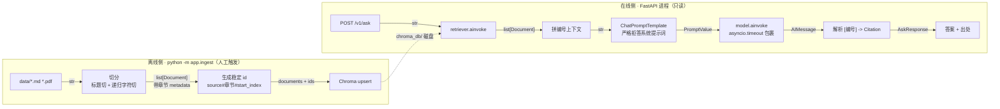

# doc-qa-service

基于 FastAPI + LangChain 的**文档问答服务**。语料场景取电商客服知识库（商品详情、退换货政策、常见问题），
对外提供一个带出处、可拒答的单轮问答接口。

> 定位说明：本项目是 Agent 开发学习路线中「LLM 应用基础 + Naive RAG」阶段的正式项目产出，
> 目标是把一条 RAG 链路按企业级标准完整走一遍。路线图后续的电商客服系统是**另起的独立项目**，
> 不在本仓库目录内继续演进。

## 一、功能需求（FR）

| 编号 | 需求 |
|---|---|
| FR-1 | 单轮问答：`POST /v1/ask` 收 `{question}`，返回 `{answer, citations[]}`；服务不保存会话 |
| FR-2 | 答案必须带出处：每条 citation 含来源文件、章节、相似度分数、原文片段 |
| FR-3 | 严格拒答：检索到的上下文无依据时明确回答「根据现有资料无法回答」，不得编造 |
| FR-4 | 语料离线入库，独立命令执行；重复入库为覆盖而非追加（幂等） |
| FR-5 | 提供 `/healthz`（存活）与 `/readyz`（就绪）探针 |

## 二、非功能需求（NFR）

| 编号 | 需求 | 当前状态 |
|---|---|---|
| NFR-1 | 性能参照目标 QPS > 200、P99 < 500ms | 未达成。当前只保证功能正确，架构上为缓存 / 批处理 / 异步预留插入点 |
| NFR-2 | 语料与向量不出本机 | 部分达成（见下方说明） |
| NFR-3 | 服务无状态，可水平扩容 | 达成 |
| NFR-4 | 可观测：结构化日志 + 全链路 request_id | 计划中 |
| NFR-5 | 配置全部来自环境变量，代码零硬编码 | 达成 |

**NFR-2 的已知缺口**：嵌入与向量检索全部在本机完成，但生成侧调用 DeepSeek 云端 API，
因此**用户问题与检索到的原文片段会离开本机**。真正的全本地方案需用 vLLM 等在本机部署开源模型。
此处如实标注，不作「数据全本地」的宣称。

## 三、架构决策记录（ADR）

### ADR-001 · 向量库选 Chroma，不选 FAISS
Chroma 自带持久化、元数据过滤与 upsert（按 id 覆盖写），三者服务端都要用；FAISS 是检索库而非数据库，
且其 LangChain 封装仅存在于已被官方 sunset 的 `langchain-community` 中，生产项目不应依赖归档包。
**代价**：单机吞吐弱于 FAISS；语料到百万级需迁移 Milvus。

### ADR-002 · 嵌入模型用本地 `BAAI/bge-small-zh-v1.5`
中文检索效果好、零调用成本、语料不出本机。
**代价**：依赖 GPU 与数 GB 的 torch；进程冷启动需加载模型，故必须在 lifespan 中只加载一次。

### ADR-003 · 写读分离：ingest 命令写库，服务进程只读
Chroma 持久化客户端不支持多进程并发写；服务未来要多进程水平扩容，若服务自身在启动时写库，
多个进程将争抢同一 SQLite 文件。
**代价**：部署时多一个入库步骤，无法「丢文件即生效」。

### ADR-004 · 采用固定管道 Naive RAG，不用 Agentic RAG
固定管道「一次检索 + 一次生成」延迟与 token 成本可预算，符合客服场景的 P99 约束；
Agentic RAG 由模型自行决定检索次数，延迟方差大。
**代价**：无法处理需要多跳推理的复杂问题。

## 四、架构图



两条链路唯一的交汇点是磁盘上的 `chroma_db/`：写的人与读的人从不在同一进程内，这即是 ADR-003 的图上形态。

## 五、目录结构

```
app/
  main.py            应用装配：lifespan、中间件、异常处理器、路由注册
  core/              工程地基（不含业务）
    config.py        环境变量 -> 带校验的 Settings
    logging.py       结构化日志 + request_id
    errors.py        统一异常与错误码
  api/               HTTP 层（只做协议转换，不含业务逻辑）
    deps.py          依赖注入
    routes/          health.py / ask.py
  schemas/           对外契约（Pydantic 模型）
  rag/               业务层（不认识 HTTP）
    chunking.py embeddings.py store.py prompt.py pipeline.py
  ingest.py          离线入库命令
data/                语料
tests/               测试
```

## 六、运行方式

### 本地

```bash
uv run python -m app.ingest            # 离线入库（改了 data/ 就重跑，幂等）
uv run fastapi dev app/main.py         # 起服务，开发模式，改代码自动重启
uv run pytest                          # 跑测试，不需要 GPU、网络、API key
.\scripts\ask.ps1 "退货的运费谁出？"    # 服务起来后提个问题（PowerShell）
```

### 容器

```bash
uv lock --check        # 确认锁文件和 pyproject 一致
docker compose build
docker compose up -d   # 先跑 ingest，成功后再起 api
```

详见 [DOCKER.md](DOCKER.md)。

## 七、接口

| 方法 | 路径 | 说明 |
|---|---|---|
| GET | `/healthz` | 存活探针。进程活着就返回 200，不查任何外部依赖 |
| GET | `/readyz` | 就绪探针。检查模型已加载且知识库非空，否则 503 |
| POST | `/v1/ask` | 问答。请求 `{"question": "..."}`，返回答案 + 出处 |
| GET | `/docs` | 交互式接口文档 |

请求样例：

```json
{"question": "退货的运费谁出？"}
```

响应样例（节选）：

```json
{
  "answer": "因商品质量问题退货的，运费由平台承担 [1]；非质量问题的无理由退货，运费由买家承担，标准为首重 12 元、续重每公斤 6 元 [1]。",
  "citations": [
    {
      "no": 1,
      "source": "after-sales-policy.md",
      "section": "售后服务政策 / 一、七天无理由退货 / 退货运费",
      "score": 0.685,
      "snippet": "### 退货运费
因商品质量问题退货的……"
    }
  ],
  "retrieved": 4,
  "elapsed_ms": 2676,
  "request_id": "586fee83c32e4c0a"
}
```

错误响应统一为：

```json
{"error": {"code": "LLM_TIMEOUT", "message": "生成超时，请稍后重试", "request_id": "..."}}
```

| 错误码 | 状态码 | 含义 |
|---|---|---|
| `VALIDATION_ERROR` | 422 | 请求参数不合法 |
| `KB_NOT_READY` | 503 | 知识库未就绪（未入库或服务未初始化完） |
| `RETRIEVAL_FAILED` | 500 | 检索环节出错 |
| `LLM_TIMEOUT` | 504 | 生成超时 |
| `LLM_FAILED` | 502 | 上游模型返回错误 |
| `INTERNAL_ERROR` | 500 | 未预料到的错误 |

## 八、文档

| 文件 | 内容 |
|---|---|
| [FLOW.md](FLOW.md) | 系统流程与函数调用关系，读代码的地图 |
| [DOCKER.md](DOCKER.md) | 容器化构建、部署、排查 |

## 九、技术栈

Python 3.12 / FastAPI / LangChain 1.4 / Chroma / sentence-transformers (BGE) / DeepSeek
