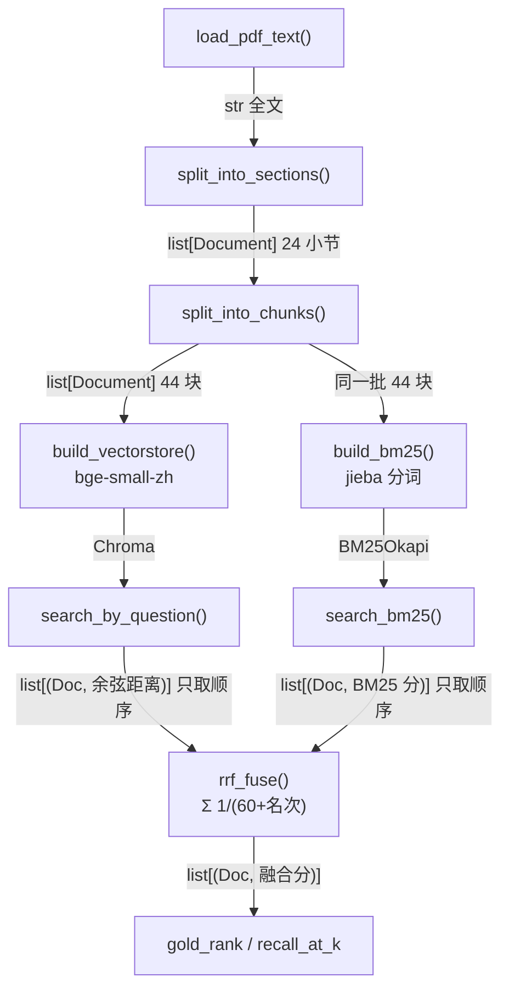
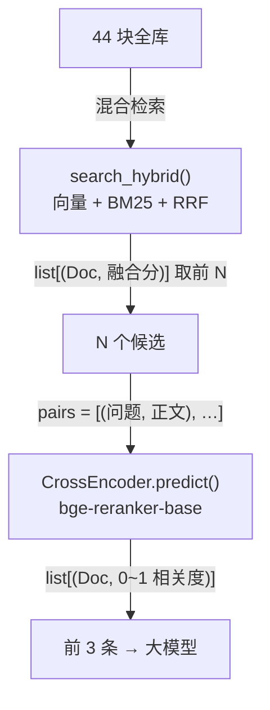

# Stage 2 · 进阶 RAG：查询改写 / 混合检索 / 重排

对应学习路线 Week 2 的前三个 checkpoint。三个知识点各占一个文件夹，共用一套语料与评估口径。

## 目录结构

```
stage2/
  pyproject.toml  uv.lock  .env  .venv/     环境（整个 stage 共用一个 uv 项目）
  data/rag_handbook.pdf                     语料：24 小节 / 8322 字 / 44 块
  common/
    build_corpus_pdf.py                     生成语料 PDF
    corpus.py                               抽 PDF → 拆小节 → 切块 → 建向量库 → 评估指标
  query_transformation/                     checkpoint 1：查询改写
    hyde_01_manual.py                       HyDE
    mq_01_manual.py  mq_02_selftests.py     Multi-Query + 重复实验
  hybrid_retrieval/                         checkpoint 2：混合检索
    hybrid_01_bm25_rrf.py                   BM25 + 向量 + 手写 RRF
  reranking/                                checkpoint 3：重排
    rerank_01_cross_encoder.py              混合召回 → cross-encoder 重排
```

**运行方式（必须在 `stage2` 目录下，用 `-m` 以模块方式启动）：**

```bash
uv run python -m query_transformation.hyde_01_manual
uv run python -m hybrid_retrieval.hybrid_01_bm25_rrf
uv run python -m reranking.rerank_01_cross_encoder
```

直接 `uv run hybrid_retrieval/hybrid_01_bm25_rrf.py` 会报 `ModuleNotFoundError: No module named 'common'`。
原因是 Python 把「启动脚本所在目录」而不是「当前目录」加入模块搜索路径，`-m` 才会把当前目录加进去。文件夹用下划线也是为此：import 语句里不允许出现连字符。

## 技术栈

| 组件 | 选型 | 说明 |
|---|---|---|
| 嵌入模型 | `BAAI/bge-small-zh-v1.5` | 归一化后余弦相似度 = 内积 |
| 向量库 | Chroma（内存） | 距离度量显式设为 cosine |
| 关键词检索 | `rank_bm25` 的 `BM25Okapi` | 不用 `BM25Retriever`：它在已归档的 `langchain-community` 里，且不返回分数 |
| 中文分词 | jieba | BM25 的必要前置 |
| 重排模型 | `BAAI/bge-reranker-base` | 0.3B 参数，512 token 上限，中英双语 |
| 大模型 | `deepseek:deepseek-v4-flash` | 仅查询改写用到 |

---

## 一、语料与评估口径

语料是自己用 reportlab 生成的 PDF，24 个小节分三部分：

- **§01~§08 RAG 技术手册**：公开知识，大模型训练时见过
- **§09~§14 虚构公司内部制度**：私有知识，大模型不可能见过，用来暴露 HyDE 的编造问题
- **§15~§24 产品与运维手册**：为混合检索补的，含稀有标识符（`X200-Pro` / `X210-Pro`、`E5021` / `E5022`、`INC-20260917-0342`、`/v1/ingest`）与近义干扰节

**标注（ground truth）写的是小节编号而不是块序号**，因为块序号会随 `chunk_size` 变化，小节编号不会。

两个指标：

- **名次**：标准答案小节第一次出现在第几名，只看最好的那一块
- **R@3**：前 3 条里命中了标准答案小节的几块 / 该小节一共几块，看覆盖面

一个真实教训：**扩语料会让老标注过期**。加入 §15/§16 之后，原本标注为 §05 的 Q1（问题里带 `X200-Pro`）就变得有争议了，因为语料里真的有讲这个型号的小节。

---

## 二、checkpoint 1：查询改写

### HyDE（Hypothetical Document Embeddings）

不拿问题去搜，而是先让大模型编一段「假答案」，拿假答案去搜。

理由：问题是短问句，文档是说明文，两者文体差别很大；假答案本身就是说明文，和文档长得像。
论文：Gao, Ma, Lin, Callan. *Precise Zero-Shot Dense Retrieval without Relevance Labels.* arXiv:2212.10496

提示词的三个要点：让模型写「文档里的一段话」而不是「回答用户」；长度贴近块大小；**绝不能写"不知道就说不知道"**——模型回答"我不清楚"时，这句话的向量毫无检索价值。编错的细节交给向量相似度过滤。

论文公式 8 的做法是生成 N 份假答案，连同原问题的向量一起取平均再检索。原问题是唯一确定不会编错的信息，放进平均里能把方向往回拉。

### Multi-Query

让大模型把一个问题改写成几个不同角度的问法，每路各搜一遍再合并。它扩大的是**角度**，不是文体——改写出来的仍然是问句，这是和 HyDE 的根本区别。

难点在合并规则（取各路最高分 / 投票）和改写本身的随机性。`mq_02_selftests.py` 用配对比较做了重复实验：同一组改写只换合并方式，这样差异才不会混进「这次改写运气好不好」。

---

## 三、checkpoint 2：混合检索（BM25 + 向量 + RRF）

### 为什么需要

向量检索比的是「意思像不像」，对只差一位数字的字符串不可靠。LangChain 官方文档原话：dense embedding 对 exact-match 查询（产品编号、人名、代码标识符）不如关键词索引。

BM25 只看三件事：词频（饱和增长，由 `k1` 控制）、词的稀有度、文档长度惩罚（由 `b` 控制）。它完全不懂语义。

### RRF：为什么不能直接相加分数

BM25 分数没有上界（实测最高 28.5），余弦相似度在 -1 到 1 之间，量纲不同。RRF 扔掉分数只用名次：

```
融合分(块) = Σ 1 / (c + 该块在第 i 路的名次)，c 通常取 60
```

出处：Cormack, Clarke, Buettcher. *Reciprocal Rank Fusion outperforms Condorcet and individual Rank Learning Methods.* SIGIR 2009.

`c` 的作用是决定「当某一路的冠军」和「两路都还不错」哪个更值钱：

```
c = 0  : 第1名 1.0000，第2名 0.5000   → 冠军通吃
c = 60 : 第1名 0.0164，第2名 0.0161   → 差距 1.5%，比的是两路共识
```

实测（44 块语料）：`c` 从 60 改到 600 结果完全不变，因为名次最大只到 44，`c=60` 时分母已经远大于名次，排序已近似退化为「按名次之和排序」。**`c` 的真正含义是相对候选数量的平滑力度。**

### 流程



向量库和 BM25 **必须索引完全相同的那批块**，否则 `rrf_fuse` 认不出「这是同一块」（它用正文字符串当键），融合会退化成两路结果的简单拼接。

手写 RRF 与 `langchain_classic.retrievers.EnsembleRetriever` 的前 3 条，13 道题全部一致。

### 这一节最有价值的失败

```
Q13  "值夜班一次补多少钱？"     标准答案 §22
     纯向量   第 1 名
     纯 BM25  第 41 名（共 44 块）
     RRF 混合 第 12 名
```

查了分词才知道原因：

```
查询分词:  值夜班 / 一次 / 补 / 多少 / 钱
文档分词:  值班 / 补贴 / 按 / 班次 / … / 工作日 / 夜班 / 每次 / 200 / 元
```

**查询切出「值夜班」，文档里是「值班」和「夜班」，三者字面都不相等，BM25 一个都匹配不上。**

> **BM25 匹配的是「词」，不是「字」。同一段文字在查询侧和文档侧被切成不同粒度，就会完全失配，而且不报错。**

BM25 排第一的那块（3.11 分）命中的是「一次」——一个近乎无意义但恰好不太常见的词。BM25 不知道哪个词承载用户意图，只知道哪个词稀有。

混合之所以跟着变差，是 `c=60` 的设计使然：标准答案在 (1, 41) 上得 1/61 + 1/101 = 0.0263，而任何「两路都排中游」的块，比如 (3, 2)，得 1/63 + 1/62 = 0.0320，反而更高。**融合是投票，不是保险：一路坏掉时，融合会比那条好的单路更差。**

### 其他实测结论

- 把 `tokenize()` 换成 `text.split()`（模拟忘记中文分词），BM25 在 6/7 道中文题上崩到第 10~24 名，但**混合那一列看起来仍然正常**，因为向量一路把结果扛住了。多路融合架构的可观测性债：**故障会被冗余掩盖，必须分路监控。**
- 唯一没崩的题是「k1 和 b 分别管什么」，因为语料里恰好有「实践中 k1 常取 1.2 到 2.0」这句，`k1` 两边有空格，`split()` 也能切出来。**英文和数字标识符自带空格，纯中文没有。**
- 全 0 分时，手写版（`sorted` 稳定排序）与官方 `BM25Retriever`（`np.argsort(scores)[::-1]`）的并列顺序相反，一个取第一块、一个取最后一块。**分数全 0 意味着 BM25 没有任何意见，此时顺序由实现细节决定，不是 bug。**

---

## 四、checkpoint 3：重排（cross-encoder）

### 两类失败，别搞混

```
找不到（召回失败）              排不准（排序失败）
正确内容没进候选集               正确内容进了候选但排在后面
       ↓                            ↓
改切分 / 加检索路                 重排
```

另一个动机来自 *Lost in the Middle*（arXiv:2307.03172）：大模型对长上下文的使用不均匀，开头结尾记得牢、中间容易忽略，所以正确内容必须排到最前，而不只是「出现在上下文里」。

### bi-encoder vs cross-encoder

| | bi-encoder（检索） | cross-encoder（重排） |
|---|---|---|
| 输入 | 问题、文档**分别**编码成向量 | 问题+文档**拼在一起**输入 |
| 预计算 | 文档侧可离线算好 | 不可能，必须实时算 |
| 复杂度 | 1 次编码 + 向量查找 | N 次模型推理（N = 候选数） |
| 全库 100 万 | 毫秒级 | 完全不可行 |
| 准确度 | 中 | 高 |

关键差别：bi-encoder 里问题和文档从没见过面，压缩时丢掉的可能正是用户关心的细节；cross-encoder 内部每个词都能看到对方的每个词，它在读两段话的关系。

### 流程



### 实测

召回 15 条时，Q13 被修好了：

```
重排前（RRF）           重排后（cross-encoder）
#1 0.0305 §15          #1 0.9294 §22 ✔
#2 0.0268 §05          #2 0.2646 §10
#3 0.0164 §22 ✔        #3 0.1194 §09
```

重排前三条 RRF 分彼此差不到一倍且排错；重排后第 1 名与第 2 名相差 3.5 倍且排对。RRF 分只是名次的函数，它不读内容。

耗时（13 道题平均）：

| 候选数 N | 召回 | 重排 | 重排占比 | 每块边际成本 |
|---|---|---|---|---|
| 3 | 16.0 ms | 28.1 ms | 64% | — |
| 10 | 13.8 ms | 71.1 ms | 84% | — |
| 15 | 8.2 ms | 94.3 ms | 92% | — |
| 44 | 11.3 ms | 244.2 ms | 95% | — |

拟合出来是 `t ≈ 12 + 5.3 × N` 毫秒：固定开销 12 ms（调度与显存搬运，与候选数无关）加线性项。**不是严格线性，候选少时固定开销摊不薄。**

外推到 10 万块：`12 + 5.3 × 100000 ≈ 530 秒`，即单次查询约 8.8 分钟；而向量检索在同样规模下仍是毫秒级（近似最近邻索引，对数级增长）。**差距约五万倍——两阶段不是设计得优雅，是另一条路根本不存在。**

### 三条边界

1. **重排的天花板是召回。** 召回 10 条时 Q1 的标准答案没进候选，表格里重排前后都是 `—`。调优要先看 Recall@N，它低了就回去改切分和检索，别调重排。
2. **收益递减，延迟线性。** 候选从 15 加到 44（2.9 倍），只有 Q13 从「12→1」多修好一题，Q7 的 R@3 反而从 2/2 掉到 1/2，而延迟涨到 2.6 倍。生产里 recall_k 常取 50 就是这条曲线上的拐点。
3. **512 token 上限是静默截断。** 超出部分完全不参与打分，无任何警告。这是「块不能切太大」的又一个理由。

### 重排救不了什么：Q1 的诊断

让重排模型给全部 44 块打分：

```
问题：我搜商品型号，比如 X200-Pro，结果老给我返回 X210-Pro 这种差一点点的，怎么办？
  #1 0.9751 §16    #2 0.9056 §15    #3 0.8004 §16
  §05（标准答案）最高名次 #10，分数 0.0018          ← 相差 540 倍
```

只改问法，语料、模型、参数都不动：

```
问题：型号这类字符串搜不准，应该用哪种检索方式？
  #1 0.6593 §05 ✔    #2 0.4682 §06
```

**同一个模型、同一份语料，换个问法，标准答案从第 10 名变成第 1 名。**

原因：原问法里最强的信号是 `X200-Pro` 和 `X210-Pro`，模型判断用户在问这两个型号，而语料里恰好有两节就是讲它们的。更根本的是，**cross-encoder 判断的是「这段文字能不能回答这个问题」，不是「能不能解决你的困境」**。Q1 要从症状推到方法，中间隔了一次推理跳跃，重排模型不做这种跳跃。

这一跳属于查询改写：HyDE 会先让大模型编一段假答案（大概率写出「可以采用 BM25 或混合检索……」），假答案里自带「BM25」「混合检索」这些词，检索就能命中 §05/§06。

**三类失败，三种工具：**

| 症状 | 原因 | 工具 |
|---|---|---|
| 答案没进候选集 | 切分 / 索引 / 召回路数不够 | 改切分、加检索路（混合检索） |
| 答案进了候选但排在后面 | 排序尺子太粗 | 重排 |
| 问题和文档「说的不是一种话」 | 中间缺一次推理或改写 | 查询改写（HyDE / Multi-Query） |

看到「检索效果不好」就换更强的模型，只能修其中一种。

---

## 五、踩过的坑

| 坑 | 现象 | 原因与处理 |
|---|---|---|
| 中文不分词 | BM25 全部给 0 分，不报错 | `BM25Retriever` 默认 `text.split()`，中文整句变成一个词。必须传 `preprocess_func=jieba.lcut` |
| 分词粒度不一致 | 查询「值夜班」对不上文档「夜班」 | BM25 按词精确匹配。可用 `jieba.lcut_for_search()` 或字级 n-gram 缓解 |
| `langchain-community` 已归档 | 运行时 DeprecationWarning | 2026-05-22 宣布停止维护、06-19 归档。`langchain_classic.retrievers.bm25` 只是转发壳，直接用 `rank_bm25` |
| 重排分数量纲 | 同一模型两种分数 | sentence-transformers 在 `num_labels=1` 时默认套 Sigmoid（0~1），transformers 直接调是 logit（实测 2.5777 ↔ 0.9294，可用 sigmoid 验算）。排序一致，**阈值代码换库即失效** |
| 召回数不是融合后截断 | 同一道题全量排序第 12，召回 10 条时却排第 1 | `search_hybrid` 的 `k` 是**每一路各取几条**，截断位置会改变 RRF 结果，不是中立操作 |
| PDF 大标题漏过滤 | 加第三部分后正则失配 | `第[一二]部分` 要同步改成 `第[一二三]部分` |
| Windows 输出乱码 | `UnicodeEncodeError` | 重定向到文件时 Python 默认 GBK，需 `PYTHONIOENCODING=utf-8` |
| HuggingFace 缓存搬不动 | robocopy 报「系统找不到指定的路径」 | `hub/snapshots/` 里全是指向 `blobs/` 的符号链接。缓存迁移改用 `HF_HOME` 环境变量，别搬文件 |

---

## 六、面试要点

**混合检索**：BM25 和向量一起跑再融合。向量的弱点是精确匹配，BM25 按字面逐词比正好补上。融合用 RRF 而不是加权求和，因为两路分数量纲不同、直接相加没有意义，而加权求和的权重需要在标注数据上调、换领域要重调；RRF 只用名次，零调参。中文场景要注意 BM25 必须分词，且查询侧和文档侧粒度要一致，否则静默失配。融合会把两路噪声一起带进来，所以后面通常还要挂重排。

**重排**：两阶段检索的第二阶段。第一阶段召回目标是不漏，第二阶段重排目标是排准。bi-encoder 把问题和文档分别编码，文档侧可离线算好所以快，但两边在模型里从没见过面；cross-encoder 把两者拼在一起输入，每个词相互可见，判断更准但必须实时算，只能用于少量候选。工程上三点：重排救不了没进候选的答案，先保 Recall@N；重排占我这条链路 85% 以上的延迟；512 token 上限会静默截断。

---

## 七、小结

**学到了什么**

- 三个知识点各自解决的是不同的失败，不能互相替代：查询改写补「问法和文档不是一种话」，混合检索补「字面精确匹配」，重排补「排序不准」。
- 评估集的质量决定实验有没有意义。最初 29 块语料下 7 道题里 6 道三路并列第 1，实验什么也证明不了；补到 44 块并加入稀有标识符和干扰节之后才出现分歧。
- 名次这个指标会饱和，差别往往体现在 R@3 和前 3 条的构成上。

**遇到的问题**

- 预测多次落空：预测 BM25 会在标识符题上赢，实际三路并列第 1（差别只在 R@3）；预测混合会在 Q13 赢，实际混合比纯向量差 11 名。**每次跑之前写死预测、跑完对照**，是这三课里最有价值的习惯。
- 扩语料导致 Q1 标注过期，尚未修（待办：改问法或改成多标准答案）。
- 目录重构：把环境上提到 `stage2/`、按技术拆文件夹、公共代码抽到 `common/`，随之而来的是运行方式从文件路径改成 `-m` 模块方式。

**实际耗时**：2026-09-20 ~ 2026-09-24，五天，含语料重建与两次全量重跑。
